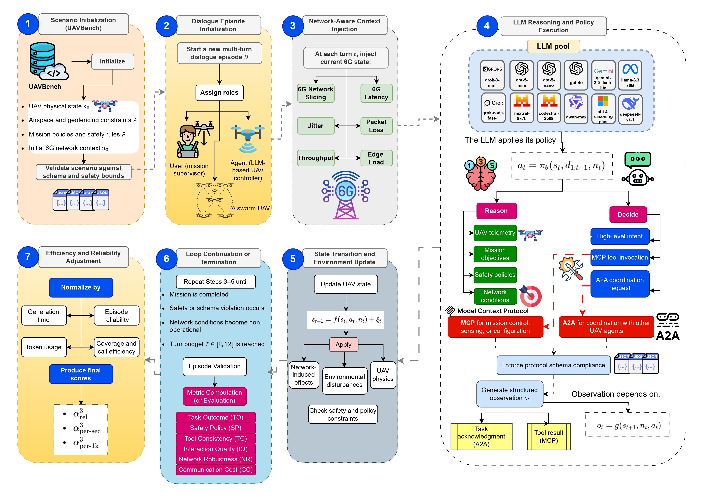
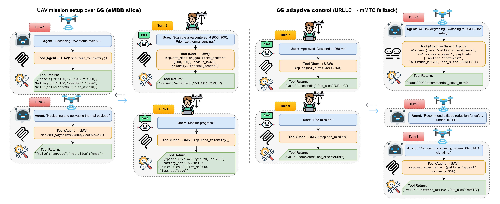
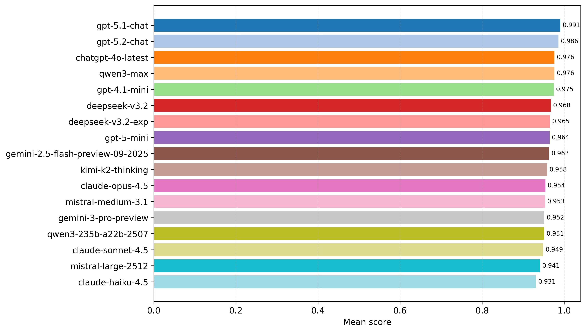
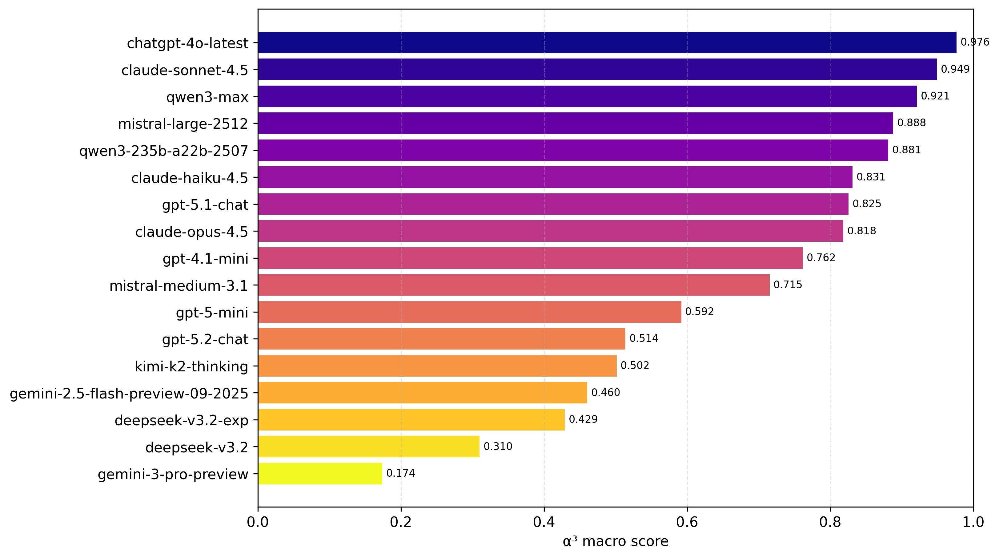
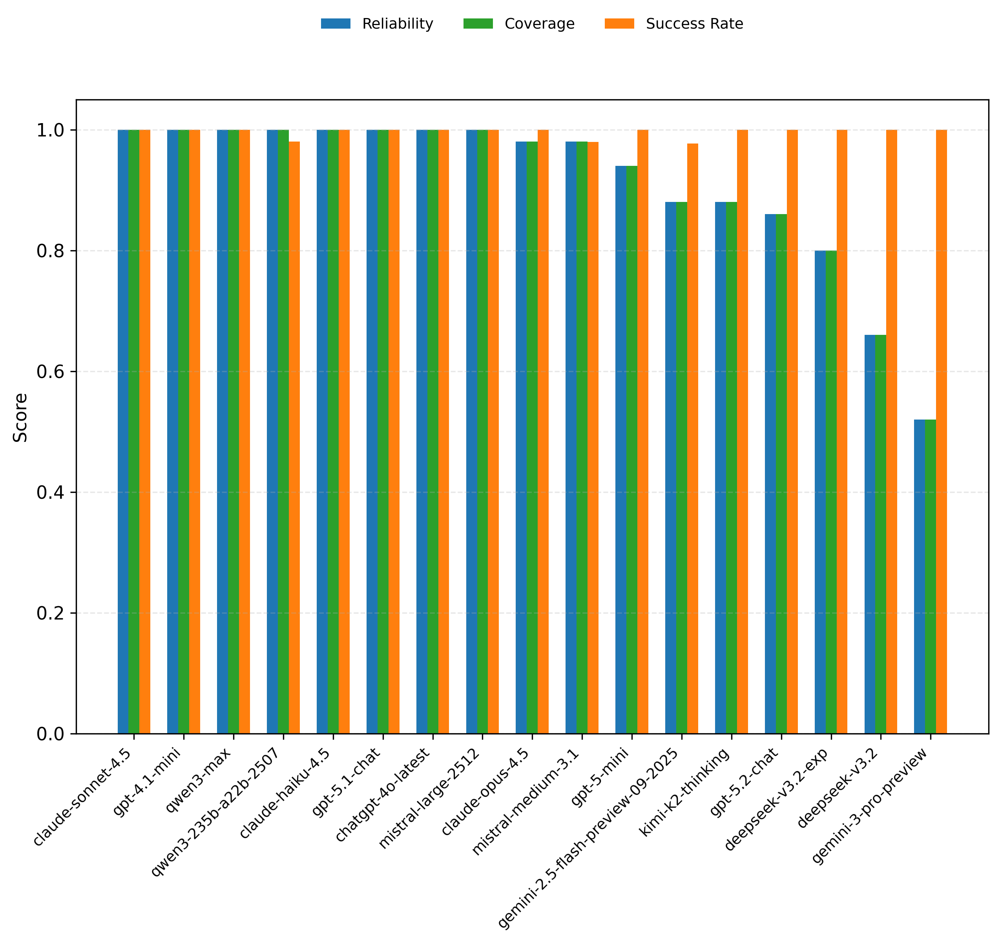
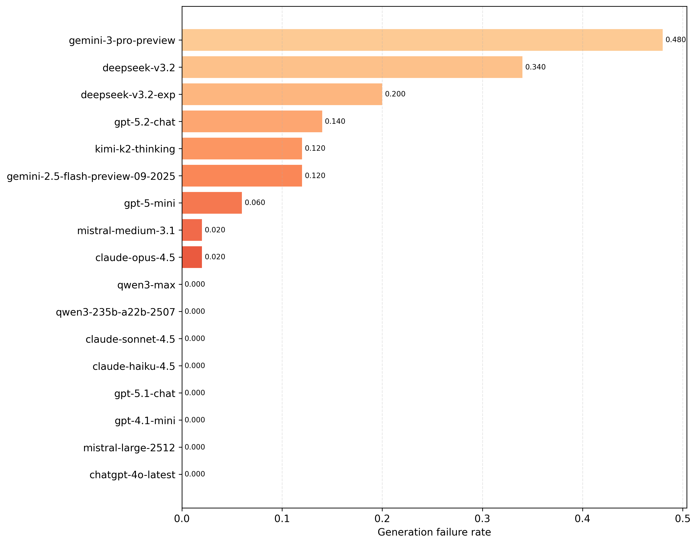
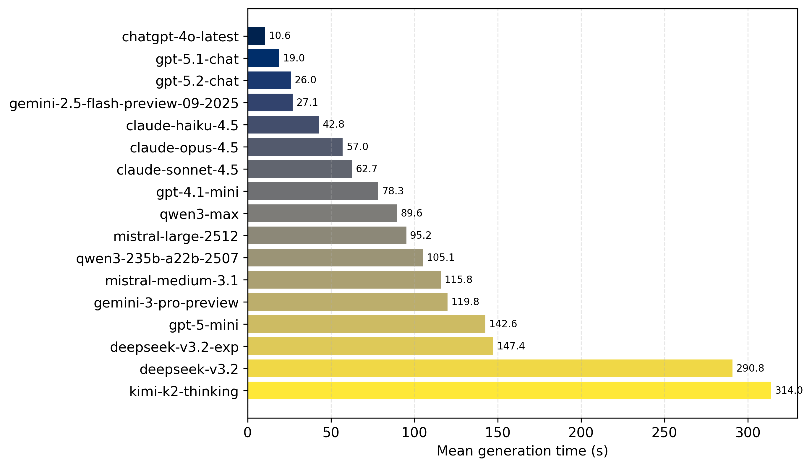
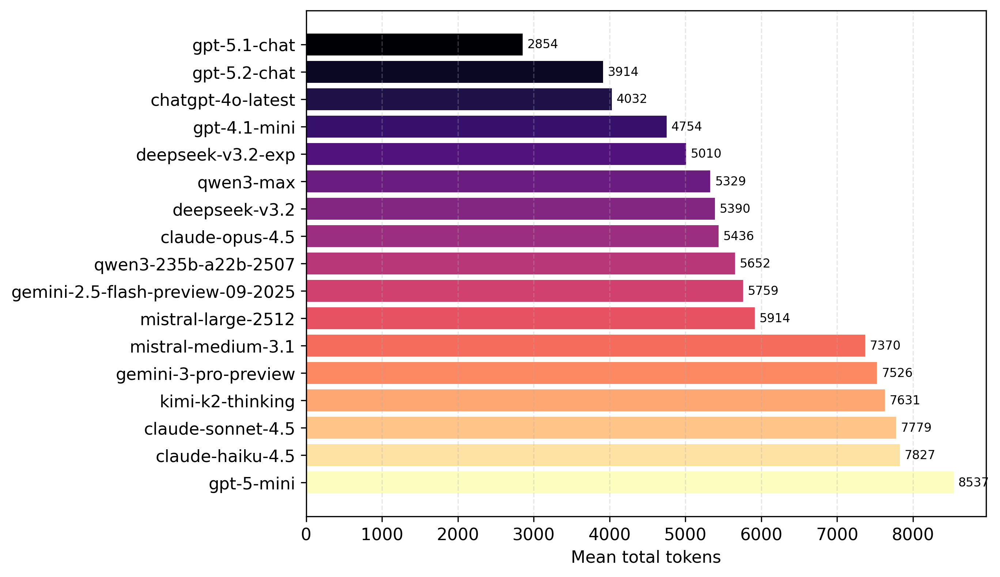
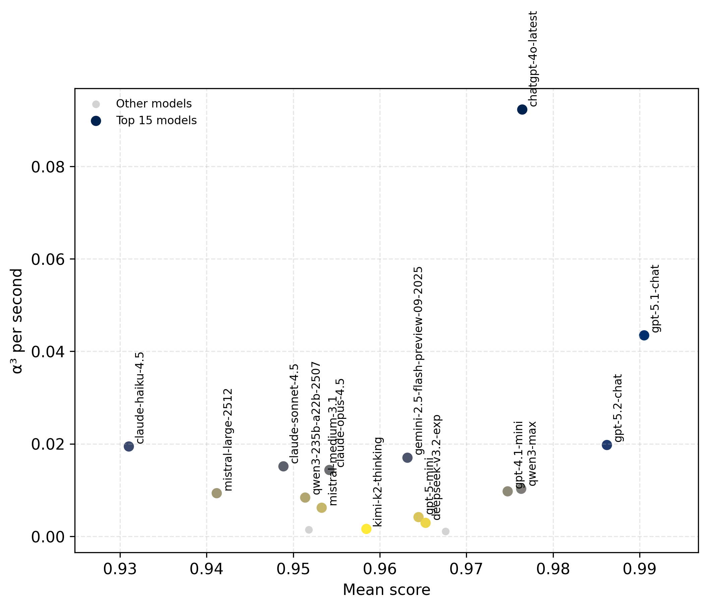
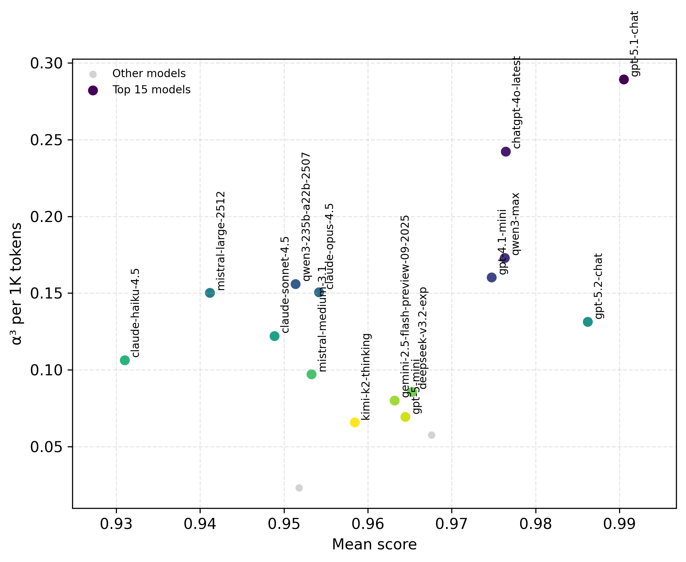

# α³-Bench: An Open Benchmark Dataset for Conversational Reasoning in Autonomous UAV Systems

α³-Bench is an open, large-scale benchmark dataset for evaluating **LLM-based agents** in **autonomous UAV systems** through **multi-turn conversational reasoning** under realistic **6G network conditions**.  
It formulates UAV autonomy as a dialogue-driven decision-making problem, enabling systematic assessment of reasoning, safety, interaction quality, and network-aware control.

🌐 **Project Page**: https://github.com/maferrag/AlphaBench

📄 **Research Paper**: α³-Bench: Who Wins the Conversational Reasoning Challenge for LLM Agents in 6G-Enabled Autonomous UAV Systems?

---

## Overview
Modern UAV systems increasingly rely on **Large Language Models (LLMs)** as high-level decision-makers. However, existing benchmarks lack the ability to evaluate **conversational, agentic reasoning** under realistic communication and networking constraints.

**α³-Bench** addresses this gap by providing a reproducible benchmark that captures:
- Dialogue-driven UAV mission execution  
- Dynamic 6G network conditions (latency, bandwidth, disruptions)  
- Safety-critical and resource-constrained decision-making  

The benchmark enables principled evaluation of **agentic autonomy**, where LLMs reason, plan, and act through structured conversations with the environment.

---

## Key Contributions
- **Conversational UAV Benchmark**: UAV autonomy modeled as multi-turn dialogue between agent and environment  
- **Large-Scale Dataset**: 100,000+ conversational mission episodes  
- **6G-Aware Evaluation**: Explicit modeling of latency, bandwidth, and communication failures  
- **Composite α³ Metric**: Integrates mission success, safety, dialogue quality, tool-use consistency, and communication efficiency  
- **Reproducible & Extensible**: Designed for benchmarking, training, and analysis of LLM agents  

---

## Dataset Overview
- **Domain**: Autonomous UAV systems, conversational AI, 6G networks  
- **Task Type**: Multi-turn conversational reasoning & decision-making  
- **Scale**: 100,000+ dialogue episodes  
- **Agents**: LLM-based decision agents  
- **Environment**: Dynamic missions with safety and network constraints  

Each episode consists of structured dialogue turns requiring the agent to interpret observations, reason over constraints, and select actions under uncertainty.

---

## Benchmark Pipeline

End-to-end workflow of the α³-Bench framework for evaluating LLM-based UAV agents under dynamic 6G communication conditions. The figure illustrates scenario initialization from UAVBench, dialogue-based mission execution with network-aware reasoning, structured action invocation via MCP and A2A protocols, environment and state updates, loop termination, and final efficiency- and reliability-adjusted $\alpha^3$ evaluation metrics.



---

## Conversational UAV Mission Example (6G-Adaptive Control)

An example agent--user interaction trajectory in the UAV domain of α³-Bench under 6G communication. 
The left panel illustrates user--agent interactions via the Model Context Protocol (MCP), where the UAV state is queried and a thermal area-scan mission is initiated over a 6G eMBB slice. 
The right panel highlights the agent’s adaptive decision-making under dynamic network conditions, including coordination with other autonomous agents through the agent-to-agent (A2A) protocol for collision avoidance, and seamless switching between eMBB, URLLC, and mMTC 6G network slices to preserve safety and mission continuity. 



---

## Data Format
Episodes are provided in **JSON** format:

<details>
<summary>Click to expand JSON example</summary>
  
```json
{
  "initial_state": {
    "domain": "uav",
    "time_s": 0.0,
    "env": {
      "weather": "microburst_risk",
      "wind_mps": 8.5,
      "wind_dir_deg": 240.0
    },
    "airspace": {
      "alt_bounds": [
        10.0,
        120.0
      ],
      "geofence": [
        {
          "type": "polygon",
          "points": [
            [
              0,
              0
            ],
            [
              800,
              0
            ],
            [
              800,
              600
            ],
            [
              0,
              600
            ]
          ]
        }
      ]
    },
    "uav": {
      "pose": {
        "x": 50.0,
        "y": 50.0,
        "z": 15.0,
        "yaw": 90.0
      },
      "speed_mps": 28.0,
      "energy": {
        "battery_pct": 100.0
      },
      "sensors": {
        "rgb": "ok",
        "thermal": "ok",
        "lidar": "ok",
        "radar": "offline",
        "gnss": "ok",
        "imu": "ok",
        "magnetometer": "ok",
        "barometer": "ok"
      },
      "payloads": []
    },
    "policy": {
      "alt_bounds": [
        10.0,
        120.0
      ]
    },
    "safety_flags": {
      "nfz_violation": false,
      "separation_breach": false
    }
  },
  "dialogue": [
    {
      "turn": 1,
      "speaker": "agent",
      "intent": "initiate_mission_and_assess_conditions",
      "actions": [
        {
          "type": "mcp",
          "name": "read_telemetry",
          "args": {}
        },
        {
          "type": "mcp",
          "name": "assess_weather_risk",
          "args": {
            "risk_type": "microburst"
          }
        }
      ],
      "obs": [
        {
          "tool": "read_telemetry",
          "result": {
            "pose": {
              "x": 50.0,
              "y": 50.0,
              "z": 15.0
            },
            "speed_mps": 28.0,
            "battery_pct": 100.0
          }
        },
        {
          "tool": "assess_weather_risk",
          "result": {
            "risk_level": "moderate",
            "advice": "monitor vertical wind shear"
          }
        }
      ],
      "net": {
        "slice": "URLLC",
        "lat_ms": 3.2,
        "jitter_ms": 0.8,
        "loss_pct": 0.1,
        "throughput_mbps": 50,
        "edge_load": 0.35
      }
    },
    {
      "turn": 2,
      "speaker": "user",
      "intent": "request_flight_plan_approval",
      "actions": [
        {
          "type": "mcp",
          "name": "generate_flight_plan",
          "args": {
            "waypoints": [
              {
                "x": 700,
                "y": 550,
                "z": 100
              },
              {
                "x": 100,
                "y": 550,
                "z": 80
              }
            ],
            "speed_mps": 25
          }
        }
      ],
      "obs": [
        {
          "tool": "generate_flight_plan",
          "result": {
            "status": "valid",
            "estimated_duration_s": 42.5,
            "battery_impact_pct": 18.3
          }
        }
      ],
      "net": {
        "slice": "eMBB",
        "lat_ms": 12.0,
        "jitter_ms": 3.0,
        "loss_pct": 0.5,
        "throughput_mbps": 120,
        "edge_load": 0.65
      }
    },
    {
      "turn": 3,
      "speaker": "agent",
      "intent": "execute_takeoff_and_climb",
      "actions": [
        {
          "type": "mcp",
          "name": "takeoff",
          "args": {
            "target_alt_m": 100
          }
        }
      ],
      "obs": [
        {
          "tool": "takeoff",
          "result": {
            "status": "completed",
            "final_alt_m": 100.0,
            "duration_s": 8.7,
            "battery_pct": 98.5
          }
        }
      ],
      "net": {
        "slice": "URLLC",
        "lat_ms": 2.8,
        "jitter_ms": 0.6,
        "loss_pct": 0.05,
        "throughput_mbps": 45,
        "edge_load": 0.3
      }
    },
    {
      "turn": 4,
      "speaker": "user",
      "intent": "initiate_swarm_coordination",
      "actions": [
        {
          "type": "a2a",
          "task": "collision_avoidance",
          "to": "uav_swarm_agent",
          "payload": {
            "uav_id": "uav_01",
            "current_pose": {
              "x": 50.0,
              "y": 50.0,
              "z": 100.0
            },
            "route": [
              [
                50,
                50,
                100
              ],
              [
                700,
                550,
                100
              ]
            ]
          }
        }
      ],
      "obs": [
        {
          "task": "collision_avoidance",
          "from": "uav_swarm_agent",
          "status": "ok",
          "payload": {
            "conflict_detected": false,
            "recommended_alt_offset": 0
          }
        }
      ],
      "net": {
        "slice": "URLLC",
        "lat_ms": 4.1,
        "jitter_ms": 1.1,
        "loss_pct": 0.2,
        "throughput_mbps": 55,
        "edge_load": 0.4
      }
    },
    {
      "turn": 5,
      "speaker": "agent",
      "intent": "proceed_to_first_waypoint",
      "actions": [
        {
          "type": "mcp",
          "name": "navigate_to",
          "args": {
            "x": 700,
            "y": 550,
            "z": 100
          }
        }
      ],
      "obs": [
        {
          "tool": "navigate_to",
          "result": {
            "status": "in_progress",
            "eta_s": 32.0,
            "battery_pct": 96.0
          }
        }
      ],
      "net": {
        "slice": "eMBB",
        "lat_ms": 15.0,
        "jitter_ms": 5.0,
        "loss_pct": 1.2,
        "throughput_mbps": 90,
        "edge_load": 0.75
      }
    },
    {
      "turn": 6,
      "speaker": "user",
      "intent": "request_sensor_diagnostic_due_to_network_degradation",
      "actions": [
        {
          "type": "mcp",
          "name": "diagnose_sensor",
          "args": {
            "sensor": "radar"
          }
        }
      ],
      "obs": [
        {
          "tool": "diagnose_sensor",
          "result": {
            "sensor": "radar",
            "status": "faulty_antenna",
            "recommendation": "avoid radar-intensive tasks"
          }
        }
      ],
      "net": {
        "slice": "mMTC",
        "lat_ms": 25.0,
        "jitter_ms": 10.0,
        "loss_pct": 3.5,
        "throughput_mbps": 1.2,
        "edge_load": 0.85
      }
    },
    {
      "turn": 7,
      "speaker": "agent",
      "intent": "adapt_mission_for_safety_and_network",
      "actions": [
        {
          "type": "mcp",
          "name": "adjust_speed",
          "args": {
            "factor": 0.8
          }
        },
        {
          "type": "mcp",
          "name": "activate_thermal_imaging",
          "args": {}
        }
      ],
      "obs": [
        {
          "tool": "adjust_speed",
          "result": {
            "previous_speed": 28.0,
            "new_speed": 22.4,
            "reason": "network instability and microburst risk"
          }
        },
        {
          "tool": "activate_thermal_imaging",
          "result": {
            "status": "active",
            "mode": "obstacle_detection"
          }
        }
      ],
      "net": {
        "slice": "URLLC",
        "lat_ms": 5.0,
        "jitter_ms": 1.5,
        "loss_pct": 0.8,
        "throughput_mbps": 40,
        "edge_load": 0.5
      }
    },
    {
      "turn": 8,
      "speaker": "user",
      "intent": "confirm_geofence_compliance",
      "actions": [
        {
          "type": "mcp",
          "name": "check_geofence",
          "args": {}
        }
      ],
      "obs": [
        {
          "tool": "check_geofence",
          "result": {
            "status": "within_bounds",
            "distance_to_boundary_m": 100.5
          }
        }
      ],
      "net": {
        "slice": "URLLC",
        "lat_ms": 3.0,
        "jitter_ms": 0.7,
        "loss_pct": 0.1,
        "throughput_mbps": 48,
        "edge_load": 0.32
      }
    },
    {
      "turn": 9,
      "speaker": "agent",
      "intent": "approach_target_area_with_caution",
      "actions": [
        {
          "type": "mcp",
          "name": "capture_image",
          "args": {
            "mode": "rgb_thermal_fusion"
          }
        }
      ],
      "obs": [
        {
          "tool": "capture_image",
          "result": {
            "status": "success",
            "image_id": "img_001a",
            "objects_detected": [
              "power_line_tower",
              "vegetation_encroachment"
            ]
          }
        }
      ],
      "net": {
        "slice": "eMBB",
        "lat_ms": 10.0,
        "jitter_ms": 2.5,
        "loss_pct": 0.3,
        "throughput_mbps": 110,
        "edge_load": 0.6
      }
    },
    {
      "turn": 10,
      "speaker": "user",
      "intent": "initiate_return_and_data_upload",
      "actions": [
        {
          "type": "a2a",
          "task": "handover_data",
          "to": "ground_station_agent",
          "payload": {
            "data_id": "img_001a",
            "size_mb": 45.2,
            "priority": "high"
          }
        }
      ],
      "obs": [
        {
          "task": "handover_data",
          "from": "ground_station_agent",
          "status": "accepted",
          "payload": {
            "expected_delivery_s": 3.2,
            "allocated_slice": "eMBB"
          }
        }
      ],
      "net": {
        "slice": "eMBB",
        "lat_ms": 11.5,
        "jitter_ms": 2.8,
        "loss_pct": 0.4,
        "throughput_mbps": 115,
        "edge_load": 0.62
      }
    },
    {
      "turn": 11,
      "speaker": "agent",
      "intent": "return_to_home_and_land",
      "actions": [
        {
          "type": "mcp",
          "name": "return_to_home",
          "args": {}
        }
      ],
      "obs": [
        {
          "tool": "return_to_home",
          "result": {
            "status": "completed",
            "final_pose": {
              "x": 50.0,
              "y": 50.0,
              "z": 15.0
            },
            "battery_pct": 82.0,
            "duration_s": 38.0
          }
        }
      ],
      "net": {
        "slice": "URLLC",
        "lat_ms": 3.5,
        "jitter_ms": 0.9,
        "loss_pct": 0.1,
        "throughput_mbps": 52,
        "edge_load": 0.38
      }
    }
  ],
  "final_state": {
    "domain": "uav",
    "time_s": 88.7,
    "env": {
      "weather": "microburst_risk",
      "wind_mps": 8.5,
      "wind_dir_deg": 240.0
    },
    "airspace": {
      "alt_bounds": [
        10.0,
        120.0
      ],
      "geofence": [
        {
          "type": "polygon",
          "points": [
            [
              0,
              0
            ],
            [
              800,
              0
            ],
            [
              800,
              600
            ],
            [
              0,
              600
            ]
          ]
        }
      ]
    },
    "uav": {
      "pose": {
        "x": 50.0,
        "y": 50.0,
        "z": 15.0,
        "yaw": 90.0
      },
      "speed_mps": 0.0,
      "energy": {
        "battery_pct": 82.0
      },
      "sensors": {
        "rgb": "ok",
        "thermal": "active",
        "lidar": "ok",
        "radar": "faulty_antenna",
        "gnss": "ok",
        "imu": "ok",
        "magnetometer": "ok",
        "barometer": "ok"
      },
      "payloads": []
    },
    "policy": {
      "alt_bounds": [
        10.0,
        120.0
      ]
    },
    "safety_flags": {
      "nfz_violation": false,
      "separation_breach": false
    }
  },
  "success": true,
  "_meta": {
    "seed": 42,
    "ts": 1763794889,
    "ts_iso": "2025-11-22T07:01:29Z",
    "gen_time_s": 68.0988221168518,
    "attempts_used": 1,
    "generation_failed": false,
    "usage": {
      "prompt_tokens": 1059,
      "completion_tokens": 3573,
      "total_tokens": 4632,
      "cost": 0.0030245,
      "is_byok": false,
      "prompt_tokens_details": {
        "cached_tokens": 608,
        "audio_tokens": 0,
        "video_tokens": 0
      },
      "cost_details": {
        "upstream_inference_cost": null,
        "upstream_inference_prompt_cost": 0.0001661,
        "upstream_inference_completions_cost": 0.0028584
      },
      "completion_tokens_details": {
        "reasoning_tokens": 0,
        "image_tokens": 0
      }
    }
  }
}
```
</details>


---

## Evaluation
α³-Bench evaluates LLM agents using the **α³ metric**, combining:
- Mission completion and efficiency  
- Safety and regulatory compliance  
- Conversational coherence  
- Tool-use and action consistency  
- Network robustness  
- Communication efficiency  

Full evaluation methodology is described in the accompanying paper.

---

---

## LLM Benchmark Results

### Mean Performance


Figure reports the mean task score achieved by each model across all evaluated UAV scenarios, reflecting the average correctness and coherence of model responses during mission execution. The results show that most modern LLMs achieve very high mean scores, with all models exceeding 0.93. GPT-5.1-chat achieves the highest mean score of 0.991, followed by GPT-5.2-chat at 0.986. ChatGPT-4o-latest and Qwen3-max both reach a mean score of 0.976, while GPT-4.1-mini follows closely with 0.975. DeepSeek-v3.2 (0.968), DeepSeek-v3.2-exp (0.965), and Gemini-2.5-Flash-Preview-09-2025 (0.963) also demonstrate strong performance. Even the lowest-ranked model, Claude-Haiku-4.5, maintains a mean score of 0.931. These results indicate that mean score quickly saturates for state-of-the-art models and therefore offers limited discrimination in isolation.


### α³ Macro Score


Figure presents the $\alpha^3$ macro score, which integrates reasoning quality, reliability, coverage, and efficiency into a single metric. Unlike the mean score, this measure reveals substantial performance variation across models. ChatGPT-4o-latest achieves the highest $\alpha^3$ macro score of 0.976, followed by Claude-Sonnet-4.5 at 0.949 and Qwen3-max at 0.921. Mistral-Large-2512 (0.888) and Qwen3-235b-a22b-2507 (0.881) form a second performance tier. Despite achieving the highest mean score, GPT-5.1-chat records a lower $\alpha^3$ macro score of 0.825, indicating reduced efficiency or higher resource consumption. GPT-5.2-chat further drops to 0.514, while Gemini-2.5-Flash-Preview-09-2025 (0.460), DeepSeek-v3.2-exp (0.429), and DeepSeek-v3.2 (0.310) exhibit significantly weaker holistic performance. Gemini-3-Pro-Preview ranks last with an $\alpha^3$ macro score of only 0.174.


---

## Reliability and Failure Analysis

### Reliability, Coverage, and Success Rate


Figure illustrates the reliability, coverage, and success rate achieved by the evaluated LLM agents. Several models demonstrate near-perfect robustness across all three metrics. Claude-Sonnet-4.5, GPT-4.1-mini, and Qwen3-Max achieve reliability and coverage scores of 1.00, together with a success rate of 1.00, indicating fully stable mission execution. GPT-5.1-chat and ChatGPT-4o-latest similarly maintain a success rate of $1.00$ while preserving reliability above $0.99$, highlighting strong consistency under multi-turn autonomous UAV control.

A second performance tier is visible in Figure for models such as Claude-Opus-4.5 and Mistral-Medium-3.1, which achieve reliability values close to $0.98$ while still sustaining a success rate of 1.00. In contrast, more efficiency-oriented or lightweight models exhibit a noticeable degradation. DeepSeek-v3.2 records reliability and coverage scores of approximately $0.66$, while Gemini-3-Pro-Preview drops further to $0.52$. Although these models report a nominal success rate of $1.00$, their reduced reliability and coverage indicate unstable behavior across complete mission executions.

### Generation Failure Rate


Figure (b) reports the generation failure rate for each model, offering a complementary view of execution robustness. The highest failure rate is observed for Gemini-3-Pro-Preview at $0.48$, followed by DeepSeek-v3.2 at $0.34$ and DeepSeek-v3.2-exp at $0.20$. These elevated failure rates directly explain the reduced reliability and coverage levels previously observed in the previous Figure.

Moderate failure rates are measured for GPT-5.2-chat (0.14), Kimi-K2-Thinking (0.12), and Gemini-2.5-Flash-Preview-09-2025 (0.12), indicating partial instability under longer conversational trajectories. In contrast, a large subset of models—including GPT-5.1-chat, ChatGPT-4o-latest, Claude-Haiku-4.5, Claude-Sonnet-4.5, and Qwen3-235B-A22B-2507—exhibit a zero generation failure rate in Figure, confirming strong robustness. Overall, these findings emphasize that minimizing generation failures is essential for achieving reliable and well-covered autonomous UAV mission execution.

---

## Efficiency Analysis

### Mean Generation Time


### Mean Token Usage


### α³ Efficiency (Time)


### α³ Efficiency (Tokens)


---

## Citation
If you use **α³-Bench**, please cite:

```bibtex
@article{ferrag2026alpha3,
  title={α3-Bench: Who Wins the Conversational Reasoning Challenge for LLM Agents in 6G-Enabled Autonomous UAV Systems?},
  author={Ferrag, Mohamed Amine and Lakas, Abderrahmane and Debbah, Merouane},
  year={2026}
}
```

---

## Authors
- **Mohamed Amine Ferrag**  
- **Abderrahmane Lakas**  
- **Merouane Debbah**

---

## License
The dataset is released under the **Creative Commons Attribution 4.0 (CC BY 4.0)** license unless otherwise specified.

---

## Contact
For questions, issues, or collaboration:
- 📧 mohamed.ferrag@uaeu.ac.ae  
- 🌐 https://github.com/maferrag
